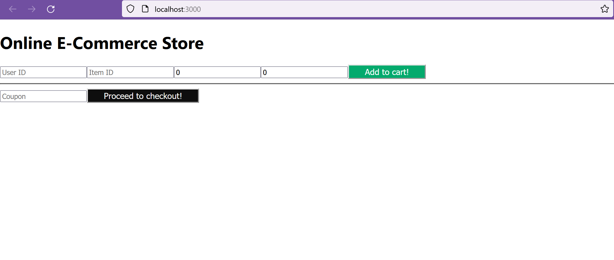
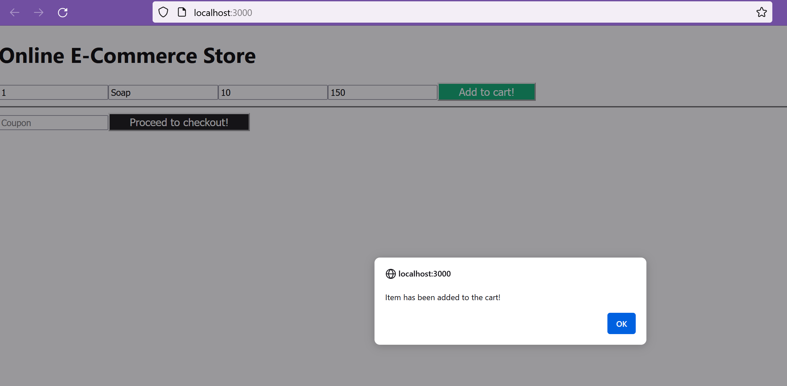
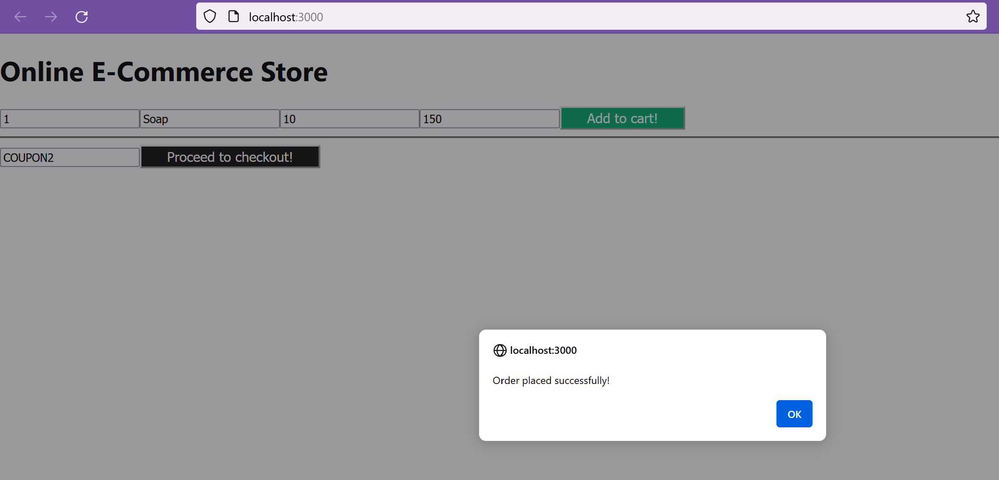
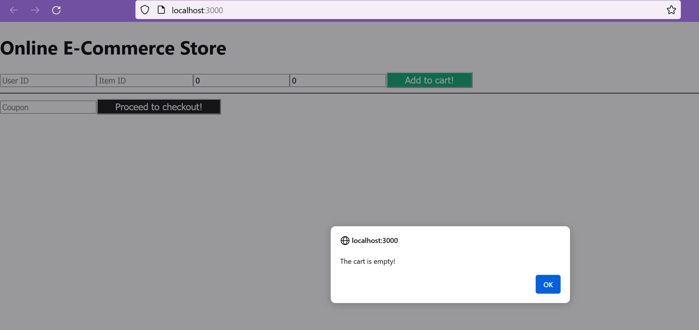
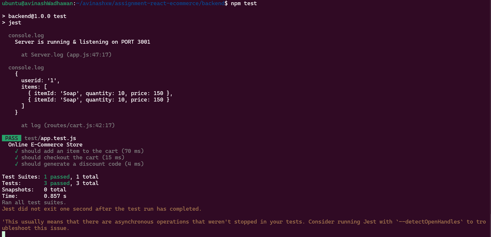

# react e-commerce project

mkdir assignment-react-ecommerce 

cd assignment-react-ecommerce/ 

git init 

touch README.md mkdir frontend mkdir backend 

## backend 
cd backend npm init 
npm install express body-parser 
touch .gitignore 
npm install -D jest supertest 
touch app.js 
node app.js 
cd routes 
touch cart.js admin.js 
npm install -D http-errors cors 

## frontend
cd frontend 
npx create-react-app .  
npm install axios 
npm install -D jest 
npm start 

## app test
cd backend 
npm test 

